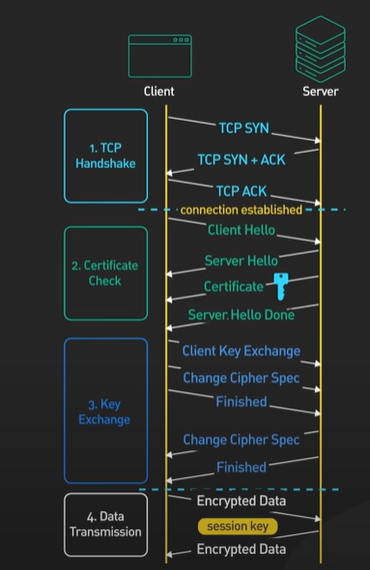

# Protocols

## HTTP

- HTTP 0.9

  1. Only supported Get
  2. only returned html
  3. no status codes
  4. no headers

- HTTP 1

  1. Added headers and status codes
  2. Added Post request
  3. Each request ad to start a no connection, no persistance.

- HTTP 1.1

  1. Added persistant connections
  2. Chucked transfer of data
  3. Better caching
  4. New headers
  5. Conditional reuests - 304 only check for updates

- HTTP 2

  1. Full request an rsponse multiplexing
  2. Breakign down body and heaaders into frames
  3. Order of loading with priotization
  4. Mutliple repsonses to one request
  5. Introducded header compression and header are no longer plain text

- HTTP 3 QUIC
  1. QUIC instead of TC and is based on UDP
  2. UDP does not require a stable netrk
  3. Quick handshalkes are faster
  4. Can secure the connection in one or zero round trips.
  5. Handles network changes without losing connection.

## FTP

File Transfer Protocol

